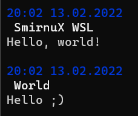

# Tipa chatik
_Almost like normal chat_



## Features
 - You can send messages
 - And you can read
 - You can upload files
 - And even download
 - and a lot of other very useful and *unique* features!

 ## Usage
 ### Compiling
```sh
make
```
 ### Launching server
```sh
./tchat -s
```
 ### Launching client
 ```sh
./tchat
```
 For chatting on one computer between different VMs tests were performed with this config:
 ```sh
        IP: 127.0.0.1
        Port: 6463
 ```
